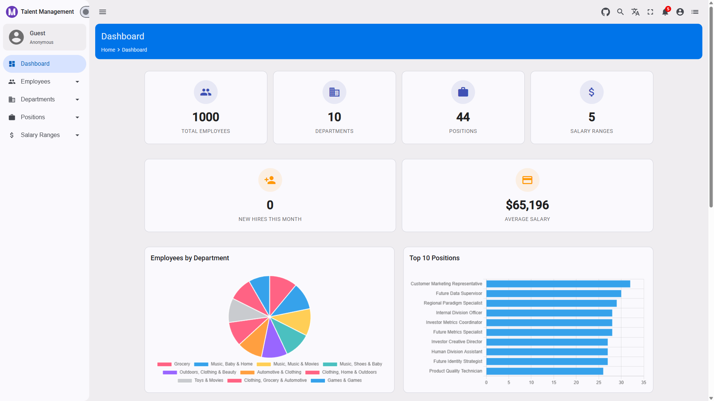
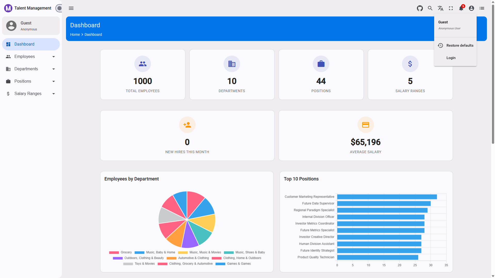
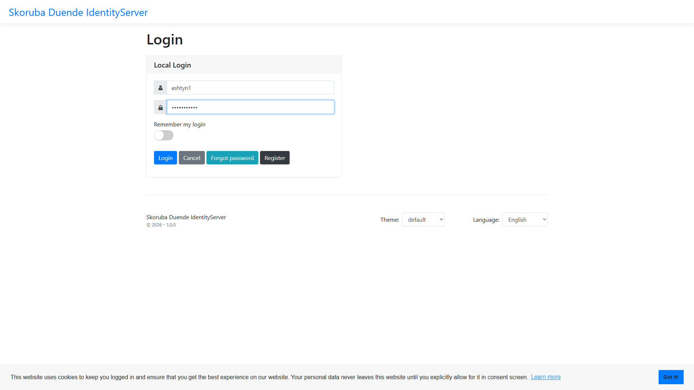
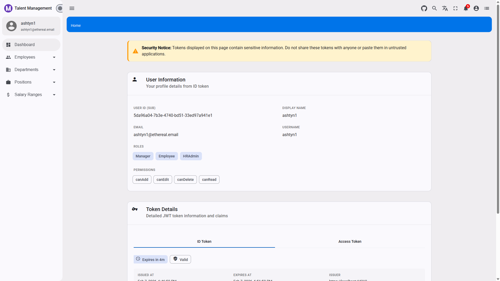
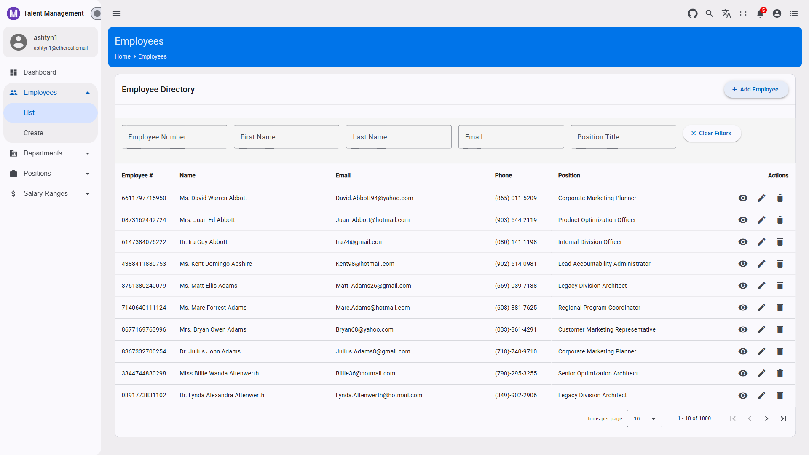
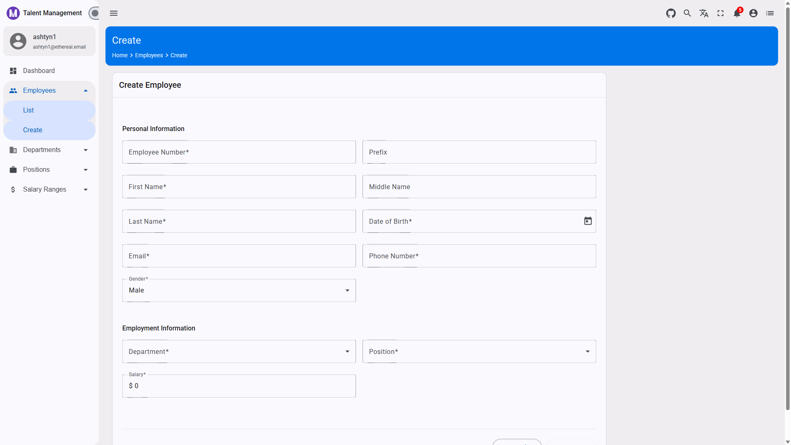

# Part 4: Angular Client Deep Dive — Modern SPA with Material Design and OIDC

## Building Modern Web Applications with Angular, .NET, and OAuth 2.0

**[← Part 3: API Resource](03-api-resource-deep-dive.md)** | **[Tutorial Home](TUTORIAL.md)** | **[Part 5: Advanced Topics →](05-advanced-topics.md)**

---

## 🎨 Introduction

The **Angular Client** is the presentation layer of the CAT pattern. It's responsible for:

* **User interface** — Providing an intuitive, responsive UI with Material Design
* **Authentication** — Managing user login/logout with OIDC using `angular-oauth2-oidc`
* **API communication** — Calling protected API endpoints with Bearer tokens
* **State management** — Managing application and user state
* **Authorization** — Showing/hiding UI based on user roles and permissions

Our **TalentManagement Angular** app uses **Angular 20** (standalone components) with **Angular Material**, **ng-matero** admin template, and **angular-oauth2-oidc** library for OIDC integration.


*Figure: Angular dashboard before authentication, showing public entry experience.*

### Why Angular with Material Design?

Angular with Material Design provides:

✅ **Type Safety** — TypeScript catches errors at compile time
✅ **Component Architecture** — Reusable, maintainable UI components
✅ **Reactive Programming** — RxJS for handling async operations
✅ **Enterprise Ready** — Battle-tested in production applications
✅ **Rich UI Components** — Material Design components out of the box
✅ **Accessibility** — Built-in ARIA support and keyboard navigation

---

## 📚 Angular Fundamentals

### Standalone Components

Angular 20 uses standalone components by default, eliminating the need for NgModules.

**Traditional (NgModule-based):**
```typescript
@NgModule({
  declarations: [AppComponent],
  imports: [BrowserModule, MatButtonModule],
  bootstrap: [AppComponent]
})
export class AppModule { }
```

**Modern (Standalone):**
```typescript
@Component({
  selector: 'app-root',
  standalone: true,
  imports: [MatButtonModule],
  template: `<button mat-raised-button>Click me</button>`
})
export class AppComponent { }
```

### Component Lifecycle

Angular components have a well-defined lifecycle:

* **`ngOnInit()`** — Initialize component, fetch data
* **`ngOnChanges()`** — React to input property changes
* **`ngOnDestroy()`** — Cleanup (unsubscribe, clear timers)
* **`ngAfterViewInit()`** — Access child components after view initialization

### Dependency Injection

Angular's DI system provides services to components:

```typescript
@Component({
  selector: 'app-employees',
  standalone: true,
  imports: [CommonModule, MatTableModule]
})
export class EmployeesComponent {
  private employeeService = inject(EmployeeService);
  private router = inject(Router);

  // Or using constructor injection
  constructor(
    private employeeService: EmployeeService,
    private router: Router
  ) { }
}
```


*Figure: Angular Material-based employee list UI with table-driven presentation.*

---

## 🏗️ Project Structure

### Application Architecture

```
talent-management/
├── src/
│   ├── app/
│   │   ├── core/
│   │   │   ├── authentication/
│   │   │   │   ├── oidc-auth.service.ts
│   │   │   │   ├── auth.service.ts
│   │   │   │   └── auth.guard.ts
│   │   │   ├── interceptors/
│   │   │   │   └── auth.interceptor.ts
│   │   │   └── services/
│   │   │
│   │   ├── shared/
│   │   │   ├── components/
│   │   │   └── pipes/
│   │   │
│   │   ├── services/
│   │   │   └── api/
│   │   │       ├── base-api.service.ts
│   │   │       ├── employee.service.ts
│   │   │       ├── department.service.ts
│   │   │       └── position.service.ts
│   │   │
│   │   ├── models/
│   │   │   ├── employee.model.ts
│   │   │   ├── department.model.ts
│   │   │   ├── position.model.ts
│   │   │   ├── gender.enum.ts
│   │   │   └── pagination.model.ts
│   │   │
│   │   ├── config/
│   │   │   └── auth.config.ts
│   │   │
│   │   ├── routes/
│   │   │   └── routes.ts
│   │   │
│   │   └── app.component.ts
│   │
│   ├── environments/
│   │   ├── environment.ts
│   │   └── environment.prod.ts
│   │
│   ├── assets/
│   ├── styles/
│   ├── index.html
│   └── main.ts
│
├── angular.json
├── package.json
└── tsconfig.json
```

---

## 🔐 OIDC Authentication

### Configuration

**environment.ts:**

```typescript
export const environment = {
  production: false,
  baseUrl: '',
  useHash: false,

  // API Configuration
  apiUrl: 'https://localhost:44378/api/v1',

  // Duende IdentityServer Configuration
  identityServerUrl: 'https://localhost:44310',
  clientId: 'TalentManagement',
  scope: 'openid profile email roles app.api.talentmanagement.read app.api.talentmanagement.write',

  // Feature Flags
  allowAnonymousAccess: true,
};
```

### Auth Configuration


*Figure: Login entry from the top-right user menu in the Angular client.*

**auth.config.ts:**

```typescript
import { AuthConfig } from 'angular-oauth2-oidc';
import { environment } from '../../environments/environment';

export const authConfig: AuthConfig = {
  // Duende IdentityServer URL
  issuer: environment.identityServerUrl,

  // URL of the Angular app (where IdentityServer will redirect after login)
  redirectUri: window.location.origin + '/callback',

  // URL to redirect after logout
  postLogoutRedirectUri: window.location.origin,

  // The Angular app's client ID as registered with IdentityServer
  clientId: environment.clientId,

  // Requested scopes
  scope: environment.scope,

  // Use Authorization Code Flow with PKCE (most secure for SPAs)
  responseType: 'code',

  // Show debug information in console (disable in production)
  showDebugInformation: !environment.production,

  // Enable silent refresh for automatic token renewal
  useSilentRefresh: true,

  // Silent refresh redirect URI
  silentRefreshRedirectUri: window.location.origin + '/silent-refresh.html',

  // Time before token expires to trigger silent refresh (in seconds)
  silentRefreshTimeout: 5000,

  // Timeout for silent refresh (in milliseconds)
  timeoutFactor: 0.75,

  // Session checks interval (in milliseconds)
  sessionChecksEnabled: true,

  // Clear hash after login
  clearHashAfterLogin: true,

  // Disable strict discovery document validation for local development
  strictDiscoveryDocumentValidation: false,

  // Skip issuer check (only for local development with localhost)
  skipIssuerCheck: !environment.production,

  // Require HTTPS (should be true in production)
  requireHttps: environment.production,

  // Request access token
  requestAccessToken: true,
};
```

### OIDC Auth Service

**oidc-auth.service.ts:**

```typescript
import { Injectable, inject } from '@angular/core';
import { Router } from '@angular/router';
import { OAuthService, OAuthEvent } from 'angular-oauth2-oidc';
import { BehaviorSubject, Subject, filter } from 'rxjs';
import { authConfig } from '../../config/auth.config';

export interface UserInfo {
  sub: string;
  name?: string;
  email?: string;
  role?: string | string[];
  [key: string]: any;
}

@Injectable({
  providedIn: 'root',
})
export class OidcAuthService {
  private oauthService = inject(OAuthService);
  private router = inject(Router);

  private isAuthenticatedSubject = new BehaviorSubject<boolean>(false);
  public isAuthenticated$ = this.isAuthenticatedSubject.asObservable();

  private userInfoSubject = new BehaviorSubject<UserInfo | null>(null);
  public userInfo$ = this.userInfoSubject.asObservable();

  // Event emitter for permission refresh
  private permissionsChangeSubject = new Subject<void>();
  public permissionsChange$ = this.permissionsChangeSubject.asObservable();

  constructor() {
    this.configureOAuth();
  }

  /**
   * Configure OAuth service with auth config
   */
  private configureOAuth(): void {
    this.oauthService.configure(authConfig);

    // Subscribe to token events
    this.oauthService.events
      .pipe(filter(e => e.type === 'token_received'))
      .subscribe(() => {
        this.handleSuccessfulLogin();
      });

    this.oauthService.events
      .pipe(filter(e => e.type === 'token_error' || e.type === 'token_refresh_error'))
      .subscribe(() => {
        console.error('Token error occurred');
      });

    // Setup automatic silent refresh
    this.oauthService.setupAutomaticSilentRefresh();
  }

  /**
   * Initialize authentication - loads discovery document and tries to process login
   */
  async initAuth(): Promise<boolean> {
    try {
      // Load discovery document (OIDC metadata from /.well-known/openid-configuration)
      await this.oauthService.loadDiscoveryDocument();

      // Try to login using authorization code flow (processes callback if present)
      await this.oauthService.tryLogin();

      // Check if we have a valid access token
      if (this.oauthService.hasValidAccessToken()) {
        await this.handleSuccessfulLogin();
        return true;
      }

      return false;
    } catch (error) {
      console.error('Error during authentication initialization:', error);
      return false;
    }
  }

  /**
   * Initiate login flow - redirects to IdentityServer
   */
  login(targetUrl?: string): void {
    if (targetUrl) {
      this.oauthService.initCodeFlow(targetUrl);
    } else {
      this.oauthService.initCodeFlow();
    }
  }

  /**
   * Logout - clears tokens and redirects to IdentityServer logout
   */
  logout(): void {
    this.oauthService.logOut();
    this.isAuthenticatedSubject.next(false);
    this.userInfoSubject.next(null);
  }

  /**
   * Get access token
   */
  getAccessToken(): string {
    return this.oauthService.getAccessToken();
  }

  /**
   * Check if user is authenticated
   */
  isAuthenticated(): boolean {
    return this.oauthService.hasValidAccessToken();
  }

  /**
   * Get user info claims
   */
  getUserInfo(): UserInfo | null {
    const claims = this.oauthService.getIdentityClaims() as UserInfo;
    return claims || null;
  }

  /**
   * Handle successful login
   */
  private async handleSuccessfulLogin(): Promise<void> {
    const userInfo = this.getUserInfo();
    this.userInfoSubject.next(userInfo);
    this.isAuthenticatedSubject.next(true);
    this.permissionsChangeSubject.next();
  }
}
```

### Auth Guard


*Figure: Redirected IdentityServer login page during Angular OIDC code flow.*

**auth.guard.ts:**

```typescript
import { inject } from '@angular/core';
import { Router, CanActivateFn } from '@angular/router';
import { OidcAuthService } from './oidc-auth.service';

export const authGuard: CanActivateFn = (route, state) => {
  const authService = inject(OidcAuthService);
  const router = inject(Router);

  if (!authService.isAuthenticated()) {
    // Store the attempted URL for redirecting
    authService.login(state.url);
    return false;
  }

  return true;
};
```

### Auth Interceptor


*Figure: Profile page reached after successful authentication and guarded routing.*

**auth.interceptor.ts:**

```typescript
import { HttpInterceptorFn } from '@angular/common/http';
import { inject } from '@angular/core';
import { OidcAuthService } from '../authentication/oidc-auth.service';
import { environment } from '../../../environments/environment';

export const authInterceptor: HttpInterceptorFn = (req, next) => {
  const authService = inject(OidcAuthService);

  // Only add token to API requests
  if (!req.url.startsWith(environment.apiUrl)) {
    return next(req);
  }

  // Get access token
  const token = authService.getAccessToken();

  // Clone request and add authorization header
  if (token) {
    const clonedRequest = req.clone({
      headers: req.headers.set('Authorization', `Bearer ${token}`)
    });
    return next(clonedRequest);
  }

  return next(req);
};
```

---

## 🌐 API Communication

### Models

**employee.model.ts:**

```typescript
import { Gender } from './gender.enum';

/**
 * Employee entity
 */
export interface Employee {
  id: string;
  firstName: string;
  middleName?: string;
  lastName: string;
  prefix?: string;
  email: string;
  phone?: string;
  employeeNumber: string;
  positionId: string;
  positionTitle?: string;
  departmentId: string;
  departmentName?: string;
  salary: number;
  birthday?: string;
  gender: Gender;
  createdAt?: string;
  lastModifiedAt?: string;
}

/**
 * Create Employee Command
 */
export interface CreateEmployeeCommand {
  employeeNumber: string;
  prefix?: string;
  firstName: string;
  middleName?: string;
  lastName: string;
  birthday: string;
  gender: Gender;
  email: string;
  phone: string;
  salary: number;
  positionId: string;
  departmentId: string;
}

/**
 * Update Employee Command
 */
export interface UpdateEmployeeCommand {
  id: string;
  employeeNumber: string;
  prefix?: string;
  firstName: string;
  middleName?: string;
  lastName: string;
  birthday: string;
  gender: Gender;
  email: string;
  phone: string;
  salary: number;
  positionId: string;
  departmentId: string;
}
```

**gender.enum.ts:**

```typescript
export enum Gender {
  Male = 0,
  Female = 1
}
```

**pagination.model.ts:**

```typescript
/**
 * Query parameters for API requests
 */
export interface QueryParams {
  pageNumber?: number;
  pageSize?: number;
  orderBy?: string;
  fields?: string;
  [key: string]: any;
}

/**
 * Pagination parameters
 */
export interface PaginationParams {
  pageNumber: number;
  pageSize: number;
}

/**
 * Paged response from API
 */
export interface PagedResponse<T> {
  succeeded: boolean;
  message: string | null;
  errors: string[] | null;
  value: T[];
  pageNumber: number;
  pageSize: number;
  totalPages: number;
  totalRecords: number;
}
```

### Base API Service


*Figure: Search and filtering behavior that maps to query parameters in API requests.*

**base-api.service.ts:**

```typescript
import { HttpClient, HttpParams } from '@angular/common/http';
import { inject } from '@angular/core';
import { Observable } from 'rxjs';
import { map } from 'rxjs/operators';
import { environment } from '../../../environments/environment';
import { PagedResponse, QueryParams } from '../../models';

/**
 * Base API Service
 * Provides common HTTP methods for all entity services
 */
export abstract class BaseApiService<T> {
  protected http = inject(HttpClient);
  protected apiUrl = environment.apiUrl;

  /**
   * Abstract property for entity endpoint
   * Must be implemented by derived classes
   */
  protected abstract readonly endpoint: string;

  /**
   * Get list of entities
   */
  getAll(params?: QueryParams): Observable<T[]> {
    const httpParams = this.buildHttpParams(params);
    return this.http.get<PagedResponse<T>>(`${this.apiUrl}/${this.endpoint}`, { params: httpParams })
      .pipe(
        map(response => response.value)
      );
  }

  /**
   * Get paged list of entities with full response
   */
  getAllPaged(params?: QueryParams): Observable<PagedResponse<T>> {
    const httpParams = this.buildHttpParams(params);
    return this.http.get<PagedResponse<T>>(`${this.apiUrl}/${this.endpoint}`, { params: httpParams });
  }

  /**
   * Get entity by ID
   */
  getById(id: string): Observable<T> {
    return this.http.get<PagedResponse<T>>(`${this.apiUrl}/${this.endpoint}/${id}`)
      .pipe(
        map(response => response.value as T)
      );
  }

  /**
   * Create new entity
   */
  create(data: Partial<T>): Observable<T> {
    return this.http.post<any>(`${this.apiUrl}/${this.endpoint}`, data)
      .pipe(
        map(response => {
          // Handle wrapped response with value property containing the ID
          if (response && 'value' in response && typeof response.value === 'string') {
            // API returns { value: "guid-string" }
            return { id: response.value } as T;
          }
          // Handle normal entity response
          return response as T;
        })
      );
  }

  /**
   * Update existing entity
   */
  update(id: string, data: Partial<T>): Observable<void> {
    return this.http.put<void>(`${this.apiUrl}/${this.endpoint}/${id}`, data);
  }

  /**
   * Delete entity
   */
  delete(id: string): Observable<void> {
    return this.http.delete<void>(`${this.apiUrl}/${this.endpoint}/${id}`);
  }

  /**
   * Build HttpParams from query parameters
   */
  protected buildHttpParams(params?: QueryParams): HttpParams {
    let httpParams = new HttpParams();

    if (params) {
      Object.keys(params).forEach(key => {
        const value = params[key];
        if (value !== null && value !== undefined) {
          httpParams = httpParams.set(key, value.toString());
        }
      });
    }

    return httpParams;
  }
}
```

**Key Features:**
* Generic base class for all API services
* Handles `PagedResponse<T>` wrapper from API
* Automatically unwraps `value` property
* Builds `HttpParams` from query parameters
* All IDs are strings (Guids)

### Employee Service


*Figure: CRUD actions in Angular that map to create/update/delete API calls.*

**employee.service.ts:**

```typescript
import { Injectable } from '@angular/core';
import { Observable } from 'rxjs';
import {
  Employee,
  CreateEmployeeCommand,
  UpdateEmployeeCommand,
  PagedResponse,
} from '../../models';
import { BaseApiService } from './base-api.service';

/**
 * Employee API Service
 */
@Injectable({
  providedIn: 'root',
})
export class EmployeeService extends BaseApiService<Employee> {
  protected readonly endpoint = 'Employees';

  /**
   * Create new employee
   */
  createEmployee(command: CreateEmployeeCommand): Observable<Employee> {
    return this.create(command);
  }

  /**
   * Update existing employee
   */
  updateEmployee(command: UpdateEmployeeCommand): Observable<void> {
    return this.update(command.id, command);
  }
}
```

**Key Features:**
* Extends `BaseApiService<Employee>`
* Inherits all CRUD methods (getAll, getById, create, update, delete)
* Only needs to define `endpoint` property
* Can add custom methods as needed


*Figure: Employee create form that sends command payloads through EmployeeService.*

---

## 📝 Summary

In this deep dive, we covered the **actual TalentManagement Angular** implementation:

✅ **Angular Fundamentals** — Standalone components, DI with inject()
✅ **OIDC Authentication** — Using `angular-oauth2-oidc` library
✅ **Auth Configuration** — AuthConfig with PKCE, silent refresh
✅ **Auth Service** — OidcAuthService with BehaviorSubjects
✅ **Auth Guard** — Functional guard with CanActivateFn
✅ **Auth Interceptor** — Functional interceptor for adding Bearer tokens
✅ **API Communication** — BaseApiService<T> generic pattern
✅ **Models** — Employee with Guid IDs, Gender enum, PagedResponse wrapper
✅ **Best Practices** — RxJS observables, TypeScript interfaces, dependency injection

### Key Architectural Decisions

**Why angular-oauth2-oidc?**
* Mature, well-maintained library
* Full OIDC support with PKCE
* Automatic token refresh
* Session management
* Discovery document support

**Why BaseApiService<T>?**
* Code reuse across all entity services
* Consistent API patterns
* Centralized error handling
* Easy to extend and customize

**Why Guid as string?**
* C# Guid → JSON string
* JavaScript doesn't have Guid type
* String is appropriate for IDs in TypeScript

**Why PagedResponse<T> wrapper?**
* API returns standardized wrapper with metadata
* Includes succeeded, message, errors properties
* Pagination info (pageNumber, totalRecords)
* Needs unwrapping to get actual data

---

**Next in series:** [Part 5 — Advanced Topics →](05-advanced-topics.md)

**Previous:** [← Part 3: API Resource Deep Dive](03-api-resource-deep-dive.md)

**Tutorial Home:** [📚 Complete Tutorial Series](TUTORIAL.md)

